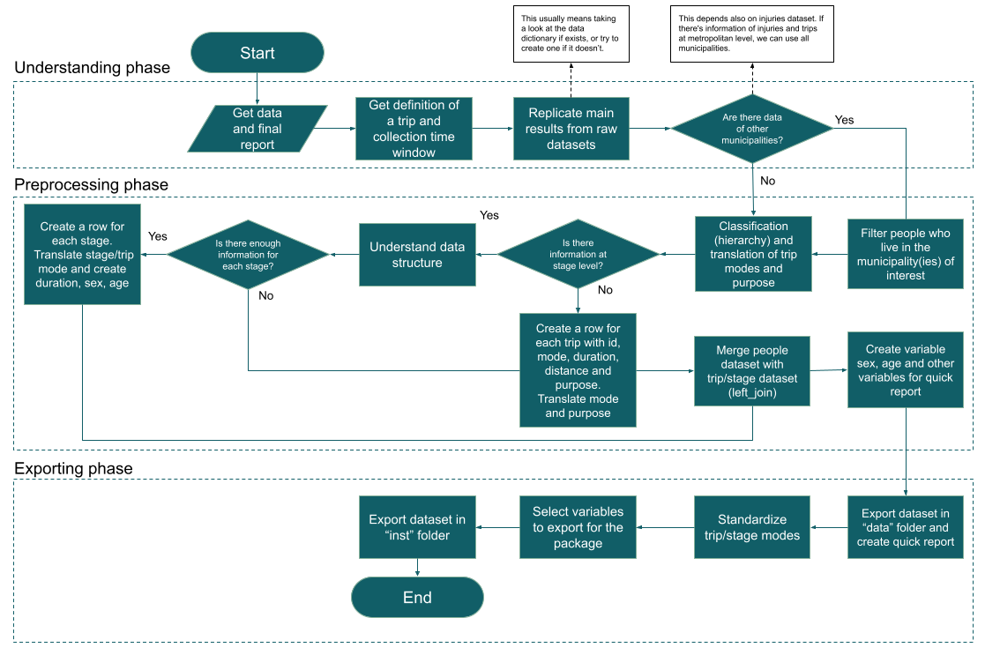

# Protocol to Make the Preprocessing and Harmonization of Travel Surveys

The purpose of this document is to give a set of guidelines that can be useful when preprocessing and/or harmonizing data from travel surveys. Each step of the way, there is a decision that needs to be done, hence here you can find the decision process made in the development of this project.

These two procedures are needed when the ITHIM model is used to compare different cities, whereas only the preprocessing is needed when the model is used to compare different scenarios in the same place. For this reason, I am going to describe the preprocessing phase first, and then explain what needs to be done to ensure a fair comparison between cities.

Before I dive into specifics, it is important to know what is the primary goal of preprocessing this kind of data. First of all, because it is perhaps the most important input in the ITHIM model being that is used to create the synthetic population, and later to create new scenarios. Second of all, because the decisions made in the preprocessing can hugely affect final results and even more when the scenarios created involve different cities.

Now, in order to give the big picture, I am going to show where the preprocessing should be going. It all starts with a "raw" database (or dataset) with the information collected in the survey[1]. Usually these data come in three (sometimes four) datasets with the information of the household, the people who live in, and the trips made by them. The fourth, or even fifth, dataset usually involves vehicle information and/or stage level information about the trips.

Having this information, the preprocessing consists in structuring these datasets into a single dataset at stage level (if possible) or at trip level. This means that the unit of analysis is at the stage (trip) level, and therefore every important feature that is not at this level needs to be added to it. Consequently, the final dataset should at least have the following columns:

- _**trip\_id**_: a unique identifier for each trip. If there is enough information at stage level, then there could be more than one row with the same ID. If that is not the case, then each row must have a unique ID, meaning there should not be duplicates in this column. To know more about whether there is enough information, read _stage level information_ section in page 5.
- _**trip\_mode**_: all trips are composed by different stages and depending on the questionnaire used to collect the data, there could be enough information to get the full picture of them. In any case, whether there is enough information at stage level or not, the trip mode is needed.
- _**trip\_duration**_: it is as simple as having the time spent in minutes in the trip. It usually comes already calculated in the datasets, but if that's not the case, it's easy to compute based on the start and end hour of the trip.
- _**trip\_distance**_: it is not usual to see this variable in the datasets because rarely a survey is going to ask about the distance travelled. For respondents is easier to estimate the time spent in a trip than the distance travelled.
- _**stage\_id:**_ a unique identifier for each stage. If there is enough information at this level, then there should be a row for each stage in a trip. Therefore, there should not be duplicates in this column.
- _**stage\_mode, stage\_duration, stage\_distance**_: similar to trip variables but at stage level.
- _**participant\_id:**_ a unique identifier for each person in the dataset. Usually, there is more than one trip per person, so there could more than one row with the same participant\_id.
- _**sex**_: it is the sex of the person who made the trip/stage. This variable usually comes from the people dataset.
- _**age**_: it is the age of the person who made the trip/stage. This variable usually comes from the people dataset.
- Other city specific variables when the analysis involves a single city.

To illustrate these variables, let say there's a survey that collects trips information at stage level. Paul is a guy that lives in the suburbs and he needs to take a bus and a metro to get to his work. The information of this trip would be saved as in Table 1.

_Table 1. Example of a single trip_

| **Stage\_id** | **Stage\_mode** | **Stage Duration** |**Trip\_id** | **Trip\_mode** | **Trip\_duration** | **Participant\_id** | **Sex** | **Age** |
| --- | --- | --- | --- | --- | --- | --- | --- | --- |
| 1-1-1 | Walk | 5 | 1-1 | Metro | 47 | 1 | male | 35 |
| 1-1-2 | Bus | 15 | 1-1 | Metro | 47 | 1 | male | 35 |
| 1-1-3 | Metro | 20 | 1-1 | Metro | 47 | 1 | male | 35 |
| 1-1-4 | Walk | 7 | 1-1 | metro | 47 | 1 | male | 35 |

In this example it is easy to see that all rows correspond to the same trip. As a I mentioned before, there is a row for each stage and the trip information is the same in all stages. If a city does not have enough information at stage level, then the stage-related columns would not exist.

Now that is clear what the package needs as an input, let&#39;s start talking about preprocessing and harmonizing procedures.

## Preprocessing

As I mentioned above, this procedure is used whether the analysis involves a single city or a variety of them. It consists in getting the right structure and the right information for the package.

There are three phases that need to be completed to get raw datasets transformed into the right format: 1) understanding phase, 2) preprocessing phase and 3) exporting phase. Figure 1 shows the steps needed in each phase and the explanation of each one of them is below.

_Figure 1. Preprocessing flowchart_

### Understanding phase

This phase is called understanding because its purpose is to get used to the way the datasets or database are organized. It consists in the following steps:

1. _Get the data and the final report:_ Even though it seems trivial, sometimes it is really difficult to get them both. The final report is important because it usually has all the technical details about the survey, such as the geographical coverage, the sampling method, the definition of a trip, the questionnaire, among others.

1. _Definition of a trip and collection time window:_ It is really important to know whether there is any restriction considered in the definition of a trip. Sometimes, distance or duration restrictions are used to get comparable results to previous surveys. To give an example, the travel survey of 2019 conducted in Bogotá collected all trips with a duration of 3 minutes or more. However, when they were analyzing the results, they considered another restriction that consisted in leaving out all walking trips shorter than 15 minutes because it allowed them to compare these results to the previous survey made in 2015.

If the analysis consists in estimating the health impacts in different scenarios in the same city, then these restrictions should be considered in the analysis process, otherwise the local authorities would not know what to do with the results.

Something similar happens to the time window asked in the survey. In the majority of cases, people are asked about the trip made the day before the survey was taking place (usually between 4 am of the day before the survey and 4 am of the day of the survey). However, there are some cases where people are asked about specific days of the week or to make a distinction between trips made during the week and on weekends. Making sure which case it is, facilitates the preprocessing procedure in following phases.

1. _Replicate main results from raw datasets:_ The purpose of replicating the main results is that one can be sure that the datasets are being used correctly. Here it is of special interest the way the sampling weights are handled because most of the results are published using them. When talking about main results, it could be as simple as calculating the total number of households, number of people, people per household, and mode share, although it could be more than that.

Since doing this part involves having a look at the data for the first time, it is important to see whether there is a data dictionary (in the final report or as a separate file) that helps the understanding of the overall structure and meaning of variables and values, and if it is not, it may be a good idea to make one.

### Preprocessing phase

This phase is called preprocessing because its purpose is to filter rows, create variables and get the structure of the dataset right. It consists in the following steps:

1. _Geographical coverage:_ Most of the surveys cover the main cities but also the municipalities around them. In this step, the decision about including more municipalities in the analysis needs to be done. This decision goes in hand with the injury&#39;s dataset. If there is information about injuries in the municipalities around, then they should be also included in the trips&#39; dataset. If not, it is better to filter them out and leave only the information at city level.

Note that expanding the coverage of the information to more municipalities, implies that the population dataset also needs to include them. Furthermore, ignoring the geographical coverage in all datasets included in the model, will impact the results significantly because the regular pattern of the city will be distorted by these differences.

To illustrate this, let&#39;s say that a travel survey includes information about a city and 5 municipalities around it, and the injuries dataset only includes information about the city. The model is then estimating the distance travelled per mode of transport and using it to estimate the number of fatalities in traffic and the risk per billion kilometers. Since the data of the travel survey have information about more places, then the distance travelled will increase and the probability of having a traffic injury will decrease. As a consequence, the number of injuries will be underestimated.

1. _Classification and translation of modes of transport:_ Usually the detail asked in travel surveys about modes of transport is larger than what is needed in the model. People are asked about whether they took a Bus or a BRT, or whether they used a bicycle or an assisted bicycle. In any case, it is important to make a reclassification of these modes, and depending on the language used the survey, a translation may be needed. To ease the process of doing this reclassification, Table 2 shows the reclassification done in the cities analyzed. Take a look at informal modes of transport, they need to be classified regardless its condition: an informal bus is a bus anyway, an informal taxi is a taxi. If there is a mode in a survey that does not appear in this table, then it can be classified as the mode that is closest to it.

_Table 2. Classification of modes of transport_

| **Modes** | **Reclassification** | **Hierarchy** |
| --- | --- | --- |
| Metro, subway, light rail, tram, trolley, train | Metro/train | 1 |
| Bus, BRT, minibus, microbus, Any bus system (metrobus, transmilenio, autobus, trolebus), Municipal bus, informal bus | Bus | 2 |
| Taxi, taxi ordered through an app, collective taxi, municipal taxi, any kind of taxi that has 4 or more wheels, informal taxi | Taxi | 3 |
| Car, SUV, UBER, pickup, van | Car | 4 |
| Motorcycle, mototaxi, assisted bicycle with combustion engine | Motorcycle | 5 |
| Motorcycle rickshaw, bicycle rickshaw | Rickshaw | 6 |
| Bicycle, assisted bicycle with electric motor | bicycle | 7 |
| Walking | Walk | 8 |
| Truck, heavy truck | Truck | 9 |
| Cable and any other mode of transport | Other | 10 |

Note that the last column of Table 2 says hierarchy. This hierarchy is important to decide the main mode of transport of a trip, based on stage modes. Public transport has the highest priority, organized by size, and private modes are then organized by their size. This is why in the example mentioned in Table 1, the trip mode is metro and not bus, because of its hierarchy.

Finally, it is important to mention that this kind of hierarchy was also used in some surveys to decide the main mode, and getting it right impacts directly the share mode. In those cases where there is already a hierarchy defined, it is recommended to use it to get the same results presented in the final report.

1. _Stage level information:_ this is perhaps one of the most important steps in the preprocessing phase. It consists in judging whether there is enough information at stage level or not. To decide if the information is enough, let me go back to the enumeration of variables mentioned in the beginning of the document. There should be a stage ID to identify the stage, a stage mode, and a stage duration or stage distance.

In the surveys analyzed so far, there is usually information about the stage ID and stage mode, but not about duration or distance. In these cases, there are different options to deal with this:

  1. _Ignore stage level information:_ even though there is information at stage level, not having the duration or the distance makes it useless. As a consequence, this information can be ignored and use the dataset at trip level.
  2. _Estimate stage duration based on trip duration:_ As I mentioned before, most of the travel surveys ask about the start and end hour of the trip; with this information the trip duration can be calculated (if it is not in the dataset already). The next step consists in estimate the stage duration based on the trip duration and the number of stages. This can be done following these considerations:
    1. _Split trip duration equally across stages:_ before doing this, investigate if there is information about the walking stages. Usually, the walking stages that correspond to the beginning and end of a trip are recorded. If this information is available, then subtract these minutes from the overall duration, and the result can be divided equally between the remaining stages. If it is not the case, then divide the overall duration equally for every stage (including walking stages). To illustrate this process, let&#39;s use the example mentioned above about Paul. In Table 3 it is assumed that there is information about the walking stages, whereas in Table 4 this information is not available.

_Table 3. Estimation of stage duration dividing equally and with walking stages_

| **Stage\_id** | **Stage\_mode** | **Stage Duration**|**Trip\_id**|**Trip\_mode**|**Trip\_duration**|**Participant\_id**|**Sex**|**Age** |
| --- | --- | --- | --- | --- | --- | --- | --- | --- |
| 1-1-1 | Walk | 5 | 1-1 | Metro | 47 | 1 | male | 35 |
| 1-1-2 | Bus | 17.5 | 1-1 | Metro | 47 | 1 | male | 35 |
| 1-1-3 | Metro | 17.5 | 1-1 | Metro | 47 | 1 | male | 35 |
| 1-1-4 | Walk | 7 | 1-1 | metro | 47 | 1 | male | 35 |

Note the difference between both approaches, the first scenario looks more realistic than the second one, because it is very unlikely that a person, Paul in this case, would spend the same number of minutes in each stage. Also note that in the second approach the duration in walking stages is almost twice than in the original, implying that he is doing more physical activity.

_Table 4. Estimation of stage duration dividing equally and without walking stages_

| **Stage\_id** | **Stage\_mode** | **Stage Duration**|**Trip\_id**|**Trip\_mode**|**Trip\_duration**|**Participant\_id**|**Sex**|**Age** |
| --- | --- | --- | --- | --- | --- | --- | --- | --- |
| 1-1-1 | Walk | 11.75 | 1-1 | Metro | 47 | 1 | male | 35 |
| 1-1-2 | Bus | 11.75 | 1-1 | Metro | 47 | 1 | male | 35 |
| 1-1-3 | Metro | 11.75 | 1-1 | Metro | 47 | 1 | male | 35 |
| 1-1-4 | Walk | 11.75 | 1-1 | metro | 47 | 1 | male | 35 |

We started using this approach in all cities that recorded walking stages. When we don&#39;t have it, then we are working at trip level.

    1. _Split trip duration using mode hierarchy:_ this approach is similar to the previous one with the difference that instead of equally splitting trip duration, this time a hierarchy is considered. So, stages made in metro are more likely to last longer than by bus, and as a consequence the duration should be split accordingly.

Even though this approach looks closer to reality, the problem with it is that is city specific and there is not way to know the hierarchy (at least that I know of).

This can be solved by looking at the distribution of trip durations by mode in only those trips that consist of only one main stage (which usually are the majority of trips). And then try to come up with a rule of thumb.

1. _A row for each trip/stage:_ Once the previous step is done, then it is easy to organize and structure the information in a way that every trip/stage is in a single row. At this point, trip variables (trip\_id, trip\_mode, trip\_duration, trip\_distance) and, if applicable, stage variables should be ready to analyze by the package.

## Harmonizing

As I mentioned before, the process of harmonization is important when the model is used in different cities simultaneously. This process goes in hand with the preprocessing because some of the decisions made for one city, should be replicated in the others. There are some important concepts that need to be harmonized:

- _Definition of a trip and collection time window:_ since each city may have its own definition of a trip (whether to included a time restriction or the definition of a time window), it is important to come with a rule that applies to every city. For instance, considering only trips that are longer than 3 minutes, even though in some cities all trips regardless time are recorded.

It is important to note that this decision may change the official mode share of some cities because there would be fewer trips.

- _Geographical coverage:_ this mainly goes in hand with the other datasets, i.e., injuries and population. However, it is important to note that if we consider other municipalities outside the inner city, it is very likely that some patterns will change, e.g., trip mode and duration.

It is also important to consider whether the municipalities around the inner cities are rural o urban because this may impact also the mode share.

- _Classification and translation of modes:_ perhaps the most important part to harmonize are the informal modes and the modes with low mode share. This is because the population of each city has its own way to move around, e.g., in some cases the motorcycle is preferred over the car, or tuk-tuks (rickshaws) are preferred over taxis.

[1](#sdfootnote1anc) Even though I used the word &quot;raw&quot;, it does not necessarily mean that it&#39;s a raw dataset. In fact, travel survey data is usually cleaned, imputed, validated and processed before it is published.
